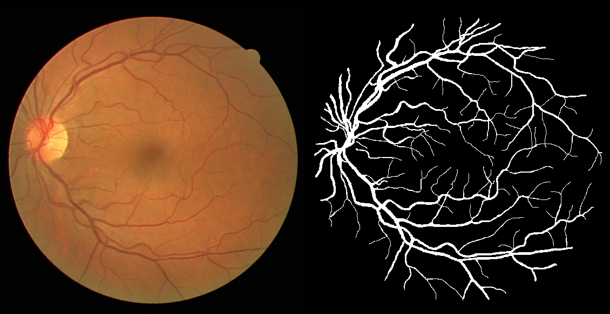
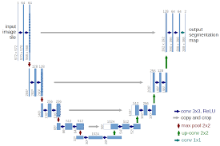
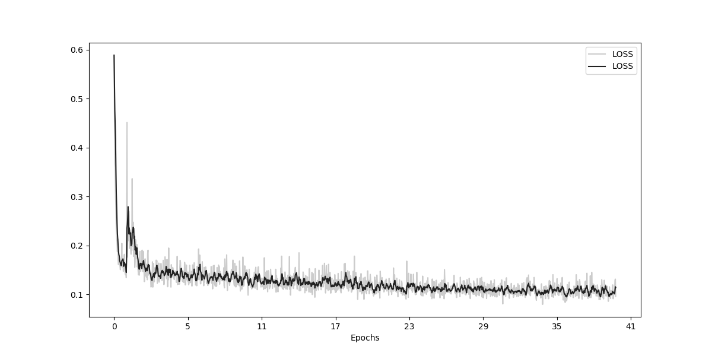
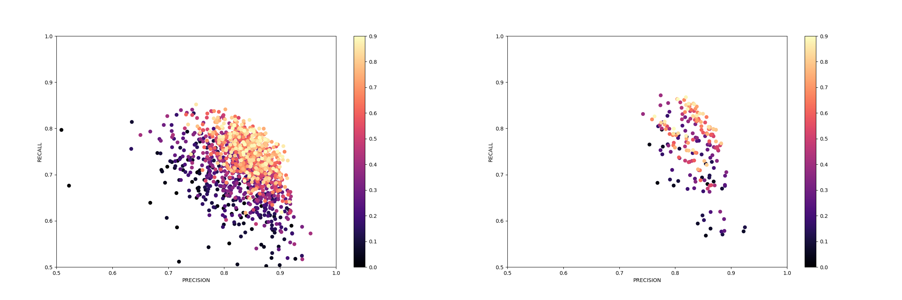
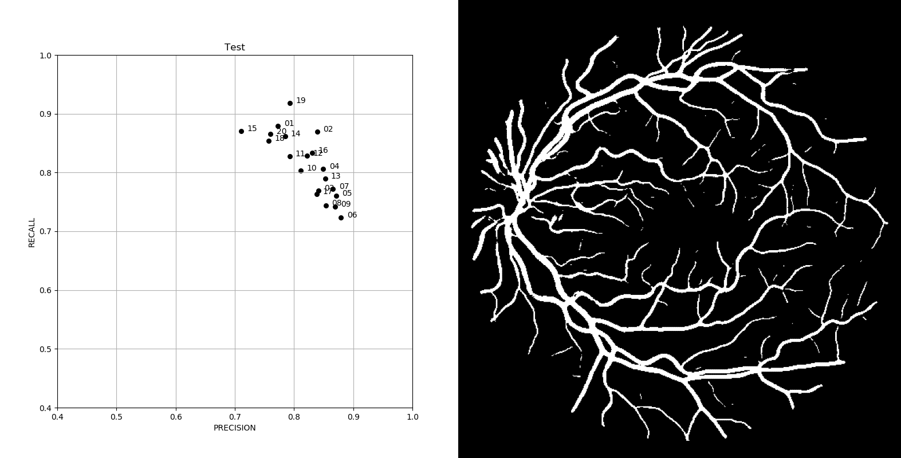

# nbee

A pytorch based framework for medical image processing with Convolutional Neural Network. 
Along with example with unet for DRIVE dataset segmentation [1]. DRIVE dataset is composed of 40 retinal fundus images. 

## Required dependencies

We need python3, numpy, pandas, pytorch, torchvision, matplotlib and PILLOW packages

```
pip install -r ature/assets/requirements.txt
```


## Project Structure

* [ature/nbee](https://github.com/sraashis/ature/tree/master/nbee) nbee framework core.
* [ature/utils](https://github.com/sraashis/ature/tree/master/utils) Utilities for dealing with F1-score, image cropping, slicing, visual precision-recall, auto split train-validation-test set and many more.
* [ature/viz](https://github.com/sraashis/ature/tree/master/viz) Easy pytorch visualization.
* [ature/testarch](https://github.com/sraashis/ature/tree/master/nbee) Full end to end working [u-net(Olaf Ronneberger et al.)](https://arxiv.org/abs/1505.04597) 
for retinal image segmentation.
* [ature/data](https://github.com/sraashis/ature/tree/master/data) DRIVE dataset..

## Dataset check
Original image and respective ground-truth image. Ground-truth is a binary image with each vessel pixel(white) 255
 and background(black) 0.


#### [U-net architecture link](https://arxiv.org/abs/1505.04597)


## Usage
Example **main.py**
```python
import testarch.unet as net
import testarch.unet.runs as r
import torchvision.transforms as tmf

# Set GPU
import torch
torch.cuda.set_device(1)

transforms = tmf.Compose([
    tmf.ToPILImage(),
    tmf.ToTensor()
])

runs = [r.DRIVE]
if __name__ == "__main__":
    net.run(runs, transforms)
```
Where ***testarch.unet.runs*** file consist a predefined configuration  ***DRIVE*** with all necessary parameters.
```python
import os
sep = os.sep
DRIVE = {
    'Params': {
        'num_channels': 1,
        'num_classes': 2,
        'batch_size': 4,
        'epochs': 40,
        'learning_rate': 0.001,
        'patch_shape': (388, 388),
        'patch_offset': (150, 150),
        'expand_patch_by': (184, 184),
        'use_gpu': True,
        'distribute': False,
        'shuffle': True,
        'log_frequency': 5,
        'validation_frequency': 1,
        'mode': 'train',
        'parallel_trained': False,
    },
    'Dirs': {
        'image': 'data' + sep + 'DRIVE' + sep + 'images',
        'mask': 'data' + sep + 'DRIVE' + sep + 'mask',
        'truth': 'data' + sep + 'DRIVE' + sep + 'manual',
        'logs': 'logs' + sep + 'DRIVE',
        'splits_json': 'data' + sep + 'DRIVE' + sep + 'splits'
    },

    'Funcs': {
        'truth_getter': lambda file_name: file_name.split('_')[0] + '_manual1.gif',
        'mask_getter': lambda file_name: file_name.split('_')[0] + '_mask.gif',
        'dparm': lambda x: [1, 1]
    }
}
```
- **num_channels**: Input channels to the CNN. We are only feeding the green channel to unet.
- **num_classes**: Output classes from CNN. We have vessel, background.
- **patch_shape, expand_patch_by**: Unet takes 388 * 388 patch but also looks at 184 pixel on each dimension equally to make it 572 * 572. We mirror image if we run to image edges when expanding.
 So 572 * 572 goes in 388 * 388 * 2 comes out.
- **patch_offset**: Overlap between two input patches. We get more data doing this.
- **distribute**: Uses all gpu in parallel if set to True. [WARN]torch.cuda.set_device(1) Mustn't be done if set to True.
- **shuffle**: Shuffle train data after every epoch.
- **log_frequency**: Just print log after this number of batches with average scores. No rocket science :).
- **validation_frequency**: Do validation after this number of epochs. We also persist the best performing model.
- **mode**: train/test.
- **parallel_trained**: If a resumed model was parallel trained or not.
- **logs**: Dir for all logs
- **splits_json**: A directory that consist of json files with list of files with keys 'train', 'test'
'validation'. [this util] (https://github.com/sraashis/ature/blob/master/utils/auto_split.py) takes a folder with all images and does that automatically. This is handy when we want to to k-fold cross validation. We jsut have to generate such k json files and put in splits_json folder. 
- **truth_getter, mask_getter**: A custom function that maps input_image to its ground_truth and mask respectively.

## Sample log
```text
workstation$ python main.py 
Total Params: 31042434
### SPLIT FOUND:  data/DRIVE/splits/UNET-DRIVE.json Loaded
Patches: 135
Patches: 9
Patches: 9
Patches: 9
Patches: 9
Patches: 9
Training...
Epochs[1/40] Batch[5/34] loss:0.72354 pre:0.326 rec:0.866 f1:0.473 acc:0.833
Epochs[1/40] Batch[10/34] loss:0.34364 pre:0.584 rec:0.638 f1:0.610 acc:0.912
Epochs[1/40] Batch[15/34] loss:0.22827 pre:0.804 rec:0.565 f1:0.664 acc:0.939
Epochs[1/40] Batch[20/34] loss:0.19549 pre:0.818 rec:0.629 f1:0.711 acc:0.947
Epochs[1/40] Batch[25/34] loss:0.17726 pre:0.713 rec:0.741 f1:0.727 acc:0.954
Epochs[1/40] Batch[30/34] loss:0.16564 pre:0.868 rec:0.691 f1:0.770 acc:0.946
Running validation..
21_training.tif  PRF1A [0.66146, 0.37939, 0.4822, 0.93911]
39_training.tif  PRF1A [0.79561, 0.28355, 0.41809, 0.93219]
37_training.tif  PRF1A [0.78338, 0.47221, 0.58924, 0.94245]
35_training.tif  PRF1A [0.83836, 0.45788, 0.59228, 0.94534]
38_training.tif  PRF1A [0.64682, 0.26709, 0.37807, 0.92416]
Score improved:  0.0 to 0.49741 BEST CHECKPOINT SAVED
Epochs[2/40] Batch[5/34] loss:0.41760 pre:0.983 rec:0.243 f1:0.389 acc:0.916
Epochs[2/40] Batch[10/34] loss:0.27762 pre:0.999 rec:0.025 f1:0.049 acc:0.916
Epochs[2/40] Batch[15/34] loss:0.25742 pre:0.982 rec:0.049 f1:0.093 acc:0.886
Epochs[2/40] Batch[20/34] loss:0.23239 pre:0.774 rec:0.421 f1:0.545 acc:0.928
Epochs[2/40] Batch[25/34] loss:0.23667 pre:0.756 rec:0.506 f1:0.607 acc:0.930
Epochs[2/40] Batch[30/34] loss:0.19529 pre:0.936 rec:0.343 f1:0.502 acc:0.923
Running validation..
21_training.tif  PRF1A [0.95381, 0.45304, 0.6143, 0.95749]
39_training.tif  PRF1A [0.84353, 0.48988, 0.6198, 0.94837]
37_training.tif  PRF1A [0.8621, 0.60001, 0.70757, 0.95665]
35_training.tif  PRF1A [0.86854, 0.64861, 0.74263, 0.96102]
38_training.tif  PRF1A [0.93073, 0.28781, 0.43966, 0.93669]
Score improved:  0.49741 to 0.63598 BEST CHECKPOINT SAVED
...
```
## Results
The network is trained for 40 epochs with 15 training images, 5 validation images and 20 test images.


Figure above is the training cross-entropy loss, F1, and accuracy.

Figure above is the precision-recall map for training and validation respectively with color being the training iterations.

Figure above is the validation F1 and Accuracy.

Figure on left is the test result on the test set after training and validation.
Right one the is the segmentation result on one of the test images.

### Thank you!'ve made it. ❤

#### References

1. J. Staal, M. Abramoff, M. Niemeijer, M. Viergever, and B. van Ginneken, “Ridge based vessel segmentation in color
images of the retina,” IEEE Transactions on Medical Imaging 23, 501–509 (2004)
2. O. Ronneberger, P. Fischer, and T. Brox, “U-net: Convolutional networks for biomedical image segmentation,” inMICCAI,(2015)
3. Dynamic Deep Networks for Retinal Vessel Segmentation, https://arxiv.org/abs/1903.07803
